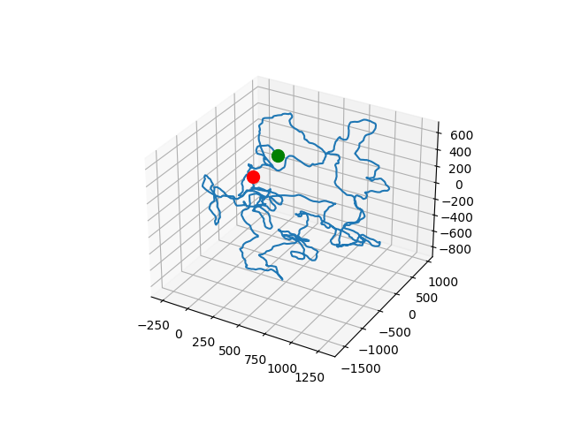

# ST2 (Théorie des Jeux) - EI Algorithmique Génétique

## Description  
Ce projet implémente deux algorithmes d'optimisation :
- **Recuit simulé**  
- **Algorithme génétique**

Le but est d'ajuster les rotations de nucléotides afin de rendre une séquence d’ADN circulaire.

---

## Installation  
Installez les dépendances requises (**numpy** et **matplotlib**) avec :  

```bash
pip install -r requirements.txt
```

## Utilisation

**Lancez le programme avec :**

```
python -m 3dna data/plasmid_8k.fasta --genetic --annealing --generations 200 --population 100 --mutation_rate 0.1
```

**Options disponibles**

- <code>data/plasmid_8k.fasta</code> : Fichier dans lequel est stocké la séquence ADN à traiter
- <code>--genetic</code> : Active l’algorithme génétique.
- <code>--annealing</code> : Active le recuit simulé.
- <code>--generations <int></code> : Nombre de générations (défaut: 100).
- <code>--population <int></code> : Taille de la population (défaut: 50).
- <code>--mutation_rate <float></code> : Probabilité de mutation par gène (ex: 0.1).

**Affichez l’aide avec :**

```
python -m 3dna --help
```

**Exemple de résultat**

Après exécution, voici un exemple de graphe obtenu :

